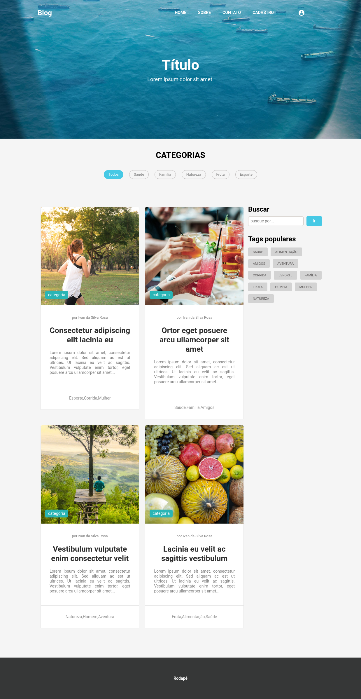

# Blog Project

> Scroll for demonstrations

## Demonstration

> _Blog project_
> 

### Description

This project was developed during the Node Js course from B7 Web.
Was developed on Linux Ubuntu 20.04.2 LTS.
Is only for study.

### For this development.

- HTML
- Javascript
- CSS
- [MongoDB-Compass] - Version 1.25.0
- [Node.JS] - Version 14.16.0 LTS
- [Material-Design-Icons]

### MongoDB Compass - Database

```sh
blog
```

### MongoDB Compass - Tables

```sh
posts {
    photo: String
    title: String
    slug: String
    body: String
    tags: String
    author: ObjectId (references: user.id)
}
users {
    name: String
    email: String
    resetPasswordToken: String
    resetPasswordTokenExpires: Date
}
```

#### To run this project

```sh
sudo service mongod start
npm start
```

## Dependencies

```sh
nodemon 2.0.7
cookie-parser: 1.4.5
dotenv: 8.2.0
express: 4.17.1
express-flash: 0.0.2
express-session: 1.17.1
jimp: 0.16.1
mongoose: 5.11.15
multer: 1.4.2
mustache-express: 1.3.0
nodemailer: 6.4.18
passport: 0.4.1
passport-local: 1.0.0
passport-local-mongoose: 6.1.0
slug: 4.0.2
uuid: 8.3
```

If you want to leave a comment, contact me!
_I'll be happy for that._

**Thank you for read!**

[mongodb-compass]: https://www.mongodb.com/
[node.js]: https://nodejs.org/en/
[material-design-icons]: https://material.io/resources/icons/
